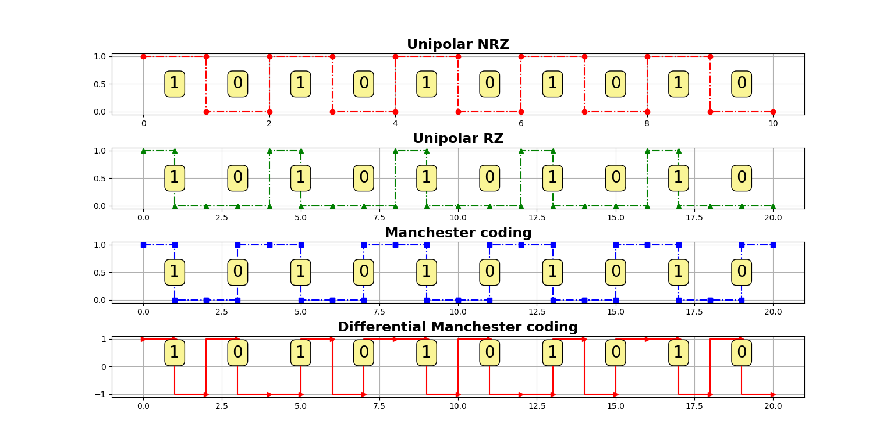
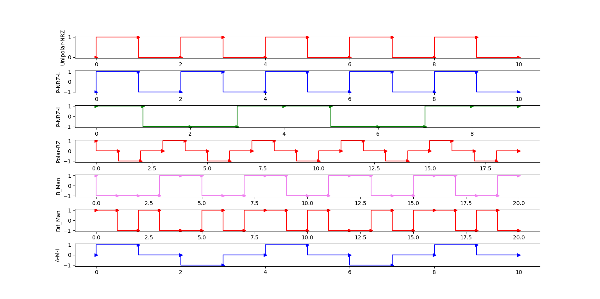

## Line encoding
Examples of line encoding techniques

## How to Use
Run
```
Enter the binary bits sequence: 1010101010
```
Press Enter

##### Diagram for Tutorial Example


##### Diagram for More line encoding
